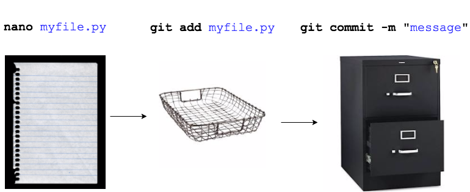

# Save Work (Git: add, commit and push a file)
task:  add changes from local computer to GitHub repo (sync repos)

## Git Flow 
| #     | Command                   | Step  | Description      |
|-------|---------------------------| -----|------------------|
|  1    | `git add <filename>`      | begin tracking a file | adds a change in the working directory to the staging area; tells Git that you want to include updates to a particular file in the next commit.  |    
|  2    | `git commit -m "message"` | log the change | changes are recorded in Git |  
|  3    | `git push`                | finalize the change | changes are pushed from Git (local, terminal) to GitHub (browser account) | 
 
---

## Git Flow Analogy


---

## Git:  add, commit and push a file

### `git add` a file
This sets a file for staging:  
 
>my example  
```console
Anastasias-MBP:git_intro anastasiaclark$ git add print_name.py
```
check the status
```console
Anastasias-MBP:git_intro anastasiaclark$ git status
On branch master
Your branch is up-to-date with 'origin/master'.
Changes to be committed:
  (use "git reset HEAD <file>..." to unstage)

	new file:   print_name.py

Anastasias-MBP:git_intro anastasiaclark$                                         
```

### `git commit -m 'message'`
>my example  
```console
Anastasias-MBP:git_intro anastasiaclark$ git commit -m 'created print_name.py'
[master 70e2190] created print.py
 1 file changed, 9 insertions(+)
 create mode 100644 print_name.py
Anastasias-MBP:git_intro anastasiaclark$
```

### `git push` (push changes up to GitHub browser)

```console
Anastasias-MBP:git_intro anastasiaclark$ git push
Counting objects: 3, done.
Delta compression using up to 4 threads.
Compressing objects: 100% (3/3), done.
Writing objects: 100% (3/3), 455 bytes | 0 bytes/s, done.
Total 3 (delta 0), reused 0 (delta 0)
To https://github.com/anastasiaclark/git_intro.git
   6614a6b..70e2190  master -> master
Anastasias-MBP:git_intro anastasiaclark$
```

Voila! Check out your forked repo on the browser and the `print_name.py` file should be there!

---

## Extra
## Let's delete (`git rm`) and rename (`git mv`) some files
- do examples
  
## Add collaborators (if you would like to share)

- Settings / Collaborators
- add GitHub username
